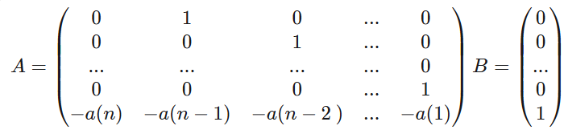

# clase-24-10-2024-1
# Introduccion a espacios de estados
los espacios de estados son una representacion de los Sistemas dinamicos, a diferencia de otras representaciones, esta tiene en cuanta como relacionan unas variables con otras, lo que nos ofrece una mejor representacion matematica de un sistema. Podemos obtener Espacios de estados a partir de otras representaciones como las ecuaciones en diferencias o funciones de transferencia.

## ¿como se escriben los espacios de estados?

Los espacios de estados originalmete se representan como ecuaciones de estado, pero esto las hace mas tedioso para trabajar, por lo que estos espacios se representan mejor como operaciones entre matrices.
### Espacio de estado como matrices.

$$X(k+1)=AX(k)+Bu(k)$$
$$Y(k)=CX(k)+Du(k)$$

En donde:

A es la matriz de estados

B es la matriz de entrada

C es la matriz de salida

D es la matriz de transmision directa

## Espacios de estado a partir de una ecuacion en diferencias
Las ecuaciones en diferencias son una forma de representar los sistemas de forma discreta, a partir de estas ecuaciones se pueden obtener las matrices A, B, C, D las cuales le daran forma a el espacio de estados que representara el comportamiento de este sistema dinamico.

Se deben seguir los siguientes pasos:

1. Se debe despejar el adelanto mas alto en la ecuacion en diferencias.
2. Igualas la salida de la ecuacion a la variable de estado X1(k).
3. Se aplican adelantos para obtener los adelantos de la variable de estado.

💡**Ejemplo 1:** 

Tenemos la ecuacion en diferencias de la forma:

$$22.5Y(K+2)+391Y(K+1)+45Y(K)=1734U(k)$$

Siguiendo el procedimiento decimos que:

1. Se debe despejar el adelanto mas alto en la ecuacion en diferencias.

$$22.5Y(K+2)=-391Y(K+1)-45Y(K)+1734U(k)$$

2. Igualas la salida de la ecuacion a la variable de estado X1(k).

$$Y(K)=X1(K)$$

3. Se aplican adelantos para obtener los adelantos de la variable de estado.

$$Y(K+1)=X1(k+1)$$

$$X1(K+1)=X2(k)$$ Ecuacion de estado 1

$$X2(K+1)=Y(K+2)$$ Ecuacion de estado 2

Por lo tanto:

$$X2(K+1)=$$

Procedemos a ordenar la matriz con las ecuaciones de estado encontradas:

$$[1,2,3;1,2,3]$$

## Espacio de estados a partir de una funcion de transferencia

Como lo habiamos visto antes, podemos tomar una funcion que represente un sistema dinamico y transformarla en un espacio de estados, en este ceso es mas sencillo encontrar las matrices, ya que solo se necesita reubicar los coeficiente de cada factor de los polinomios del numerador y denominador, cabe aclarar que hay 3 maneras diferentes de ordenar estas matrices, dependiendo de en que forma queramos el espacio de estados.

###espacio de estados de forma canonica controlable

si tenemos una matriz de la forma:

$$\frac{b0Z^{n}+b1Z^{n-1}+...+b{n-1}Z+bn}{Z^{n}+a1Z^{n-1}+...+a{n-1}Z+an}$$

Los polinomios se pueden reorganizar de tal forma que queden las matrices que forman el espacio de estados.

Figura 1. Matriz A y B espacio de estados de forma canonica controlable.

Figura 2. Matriz C espacio de estados de forma canonica controlable.

###espacio de estados de forma canonica Obserbable

si tenemos una matriz de la forma:

$$\frac{b0Z^{n}+b1Z^{n-1}+...+b{n-1}Z+bn}{Z^{n}+a1Z^{n-1}+...+a{n-1}Z+an}$$

Figura 3. Matriz A y B espacio de estados de forma canonica Obserbable.

Figura 4. Matriz C espacio de estados de forma canonica Obserbable.

### Forma canonica Diagonal

Si en lugar de dos polinomios, conocemos solo los polos y los ceros de la funcion, tambien es posible usarlos para representar el sistema dinamico en espacios de estado.

Figura 5. Matriz A y B espacio de estados de forma canonica Diagonal.

Figura 6. Matriz C espacio de estados de forma canonica Diagonal.

En donde P se refiere a cada uno de los polo del sistema, y C son los coeficientes encontrados al aplicar fracciones parciales a la funcion de transferencia.

